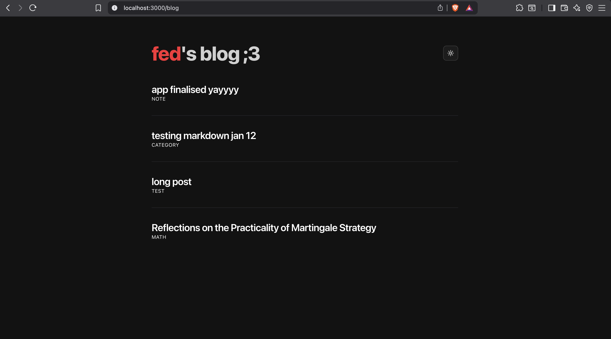
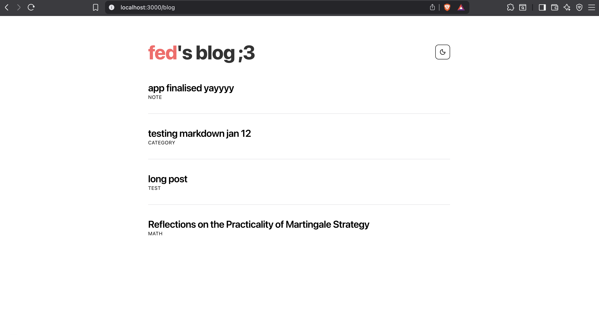
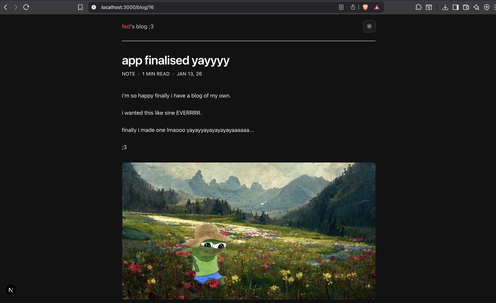
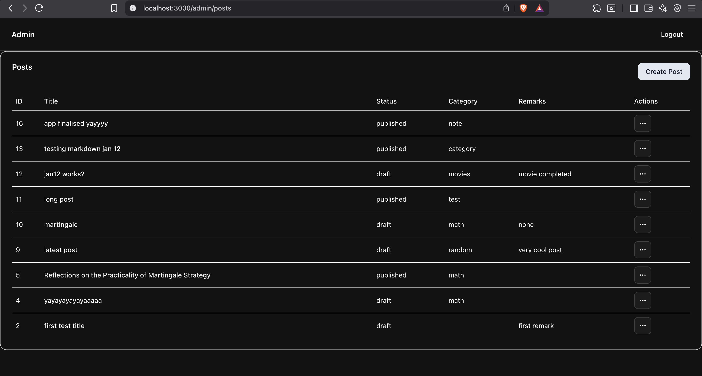
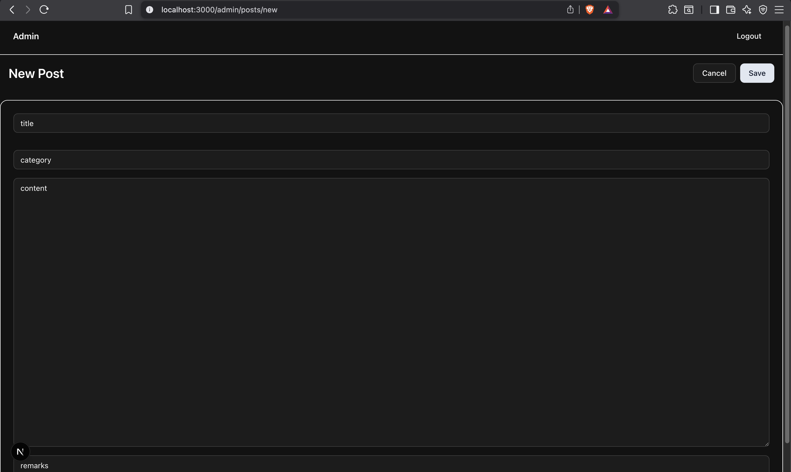

# fed’s blog ;3

Always wanted to create a blog for myself and I just did it!

Built with **Next.js (App Router)**, **Supabase**, and **shadcn**.


### Features

- Public blog pages
- Admin dashboard
- Create, edit, delete posts
- Draft / publish workflow
- Preserves original publish dates
- Supabase authentication + RLS
- Protected admin routes

### Screenshots

#### Blog - Dark


#### Blog - Light


#### Post view


#### Admin dashboard


#### Editor


## Tech Stack

- Next.js (App Router)
- Supabase (Database, Auth)
- shadcn
- Tailwind CSS

## Development

```bash
npm install
npm run dev
```

Create a .env.local with:
```
NEXT_PUBLIC_SUPABASE_URL=your_supabase_url
NEXT_PUBLIC_SUPABASE_ANON_KEY=your_anon_key
```

## Notes
- Admin routes are under /admin
- Only published posts are visible publicly
- This project is intentionally minimal and opinionated